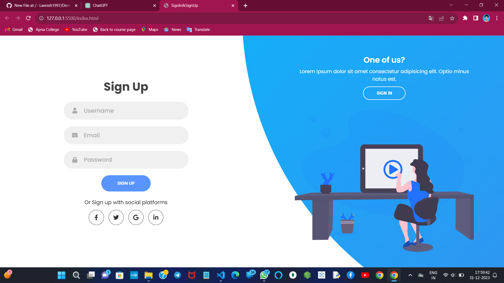

  
  <h2 align="center">Responsive Sign-In & Sign-Up Page</h2>

  A modern and responsive web page for user authentication, featuring a sign-in and sign-up interface with dynamic animations.

  <a href="https://lavnish1997.github.io/Devtern_Task_01/"><strong>➥ Live Demo</strong></a>

 

##Table of Contents
-[Live Demo](#live-demo)
-[Description](#description)
-[Features](#features)
-[Screenshots](#screenshots)
-[Technologies Used](#technologies-used)
-[Getting Started](#getting-started)
-[Usage](#usage)
-[Contributing](#contributing)
-[License](#license)
-[Acknowledgments](#acknowledgments)
-[Contact Information](#contact-information)

##Description
This project provides a user-friendly interface for signing in or signing up, with a visually appealing design. The web page is built with HTML, CSS, and JavaScript, and it includes dynamic animations to enhance the user experience.

##Features
Sign-in and sign-up forms with smooth transitions.
Responsive design for various screen sizes.
Interactive buttons and social media icons.
Animation effects for a modern look and feel.

##Screenshots

##Technologies Used
HTML
CSS
JavaScript

##Getting Started
Clone the repository:
##Getting Started
bash
Copy code
git clone https://github.com/Lavnish1997/sign-in-sign-up-webpage.git
Open the index.html file in a web browser.

##Usage
Click the "Sign Up" button to switch to the sign-up mode.
Click the "Sign In" button to switch back to the sign-in mode.
Fill in the required fields in the forms and submit for authentication.
Contributing
Contributions are welcome! Feel free to open issues or pull requests.

##License
This project is licensed under the MIT License.

##Acknowledgments
Font Awesome for social media icons.
Google Fonts for the "Poppins" font.

##Contact Information
Mobile Number:+91-9557147899
E-mail Id:lavnishsingh1997@gmail.com